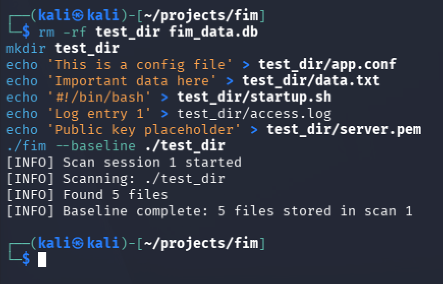
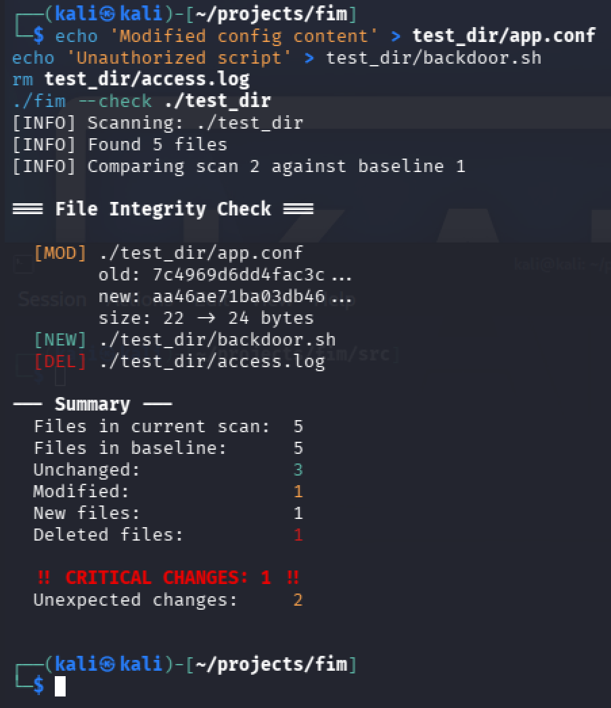
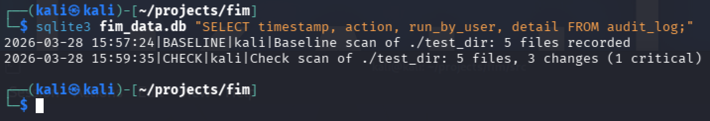

# File Integrity Monitor (FIM)

A command-line tool written in C that monitors directories for unauthorized changes. It hashes files with SHA-256, stores results in a SQLite database, and flags modifications, additions, and deletions between scans. Every action is logged with a timestamp and username for accountability.

## Why I Built This

While working through my cybersecurity and computer science coursework, I got curious about what a practical, real-world use of C would look like outside of class assignments. I kept coming across tools like AIDE and Tripwire in my studies and wanted to understand how they actually work at the code level. A system that manages student records seemed like a fitting scenario since I was already studying how to protect sensitive data and thinking about what it takes to verify that files on a system have not been tampered with.

I also used this as an opportunity to pick up SQL. I had not worked with databases directly in a project before, so I researched SQLite and applied what I learned to build the audit history and file tracking features. Every query in the project uses parameterized binding, which ties back to the SQL injection prevention concepts I studied in my secure coding courses.

## How It Works

The tool has three modes:

- `--baseline` scans a directory, hashes every file, and stores the results as a known-good snapshot
- `--check` scans the same directory again and compares it to the stored baseline, reporting what changed
- `--report` pulls up the stored results from the last check

When you run a check, each change gets classified. Files in sensitive paths (like `.conf`, `.pem`, `/etc/shadow`) are flagged as critical. Everything else is marked as unexpected. If nothing changed, the tool confirms integrity is intact.

## Screenshots

### Baseline scan
Creates the initial snapshot of a directory and stores file hashes in the database.



### Integrity check
After modifying a config file, adding an unauthorized script, and deleting a log file, the tool detects all three changes and flags the config modification as critical.



### Audit log
Every scan is recorded with who ran it, when, and what happened. This supports audit requirements like NIST AU-12.



## Project Structure

```
src/
├── main.c          CLI argument parsing and dispatch
├── scanner.c/.h    Directory traversal and SHA-256 hashing
├── database.c/.h   SQLite operations (all parameterized queries)
├── reporter.c/.h   Scan comparison, classification, and output
└── fim_types.h     Shared structs and enums
```

I kept the modules separated so the scanner has zero knowledge of SQLite, and the database layer has zero knowledge of the filesystem. The reporter pulls from both. This also means the core logic could be reused with a different frontend if needed.

## Building

### Prerequisites

- GCC or any C11 compiler
- OpenSSL dev libraries
- SQLite3 dev libraries

On Debian/Kali/Ubuntu:
```bash
sudo apt-get install build-essential libssl-dev libsqlite3-dev
```

### Compile
```bash
make
```

If you get an error about `lstat` being undeclared, make sure the Makefile has `-D_DEFAULT_SOURCE` in the CFLAGS line. This enables POSIX functions that strict C11 mode hides by default.

### Run
```bash
# Create a baseline
./fim --baseline /path/to/directory

# Check for changes later
./fim --check /path/to/directory

# View stored report
./fim --report /path/to/directory
```

A test script is included that creates sample files, baselines them, simulates changes, and runs a check:
```bash
chmod +x test_fim.sh
./test_fim.sh
```

## Database

The tool creates three tables in a local SQLite file (`fim_data.db`):

- **scans** tracks each session (who ran it, when, what path, what mode)
- **file_records** stores one row per file per scan (path, hash, size, permissions, change status, classification)
- **audit_log** records every tool action for accountability

All queries use `sqlite3_prepare_v2` with parameter binding. No user input is ever concatenated into a query string.

## Security Notes

A few things I focused on while writing this:

- String operations use `strncpy` and `snprintf` with explicit size limits to prevent buffer overflows
- Symbolic links are skipped during traversal so the tool cannot be tricked into following paths outside the target directory
- Memory allocated with `malloc`/`calloc` is freed on all code paths, including error branches
- The OpenSSL digest buffer is zeroed after use
- File read buffers are zeroed after hashing

This tool detects unauthorized changes but does not validate whether code was safe to begin with. If a malicious payload is already present when the baseline is taken, FIM will treat it as normal. Initial code validation requires separate measures like hash verification against a trusted source, static analysis, or sandbox testing.

## Limitations and What I Learned

Building this helped me understand not just how file integrity monitoring works, but where it falls short. A few things stood out:

- **Dormant or timed attacks are invisible to FIM.** If malicious code is designed to sit quietly until a specific date or trigger condition, the baseline scan would record it as normal. The files never change, so FIM has nothing to flag. Catching that kind of threat requires runtime monitoring, behavioral analysis, or code review before the baseline is ever taken.
- **This tool only catches changes when you run it.** There is no daemon or background process watching in real time. If something is modified and then changed back before the next scan, FIM would never know. Production tools like OSSEC handle this with continuous monitoring, which is a layer beyond what this project covers.
- **The tool itself is a target.** If an attacker can modify the FIM binary or the SQLite database file, the results cannot be trusted. In a production environment you would want to store the database on a separate read-only volume or remote system, and verify the integrity of the tool itself before running it.
- **Permissions limit visibility.** Running FIM as a regular user means it can only hash files that user has read access to. System-level monitoring would need elevated privileges, which introduces its own set of risks.
- **The database is not encrypted.** File paths, hashes, and scan metadata are stored in plain text in the SQLite file. For a system protecting sensitive records, the database itself would need encryption at rest to prevent information leakage about what files exist on the system.

These are areas I would want to address if I continued developing this, and they gave me a better appreciation for why enterprise integrity monitoring tools are as complex as they are.
